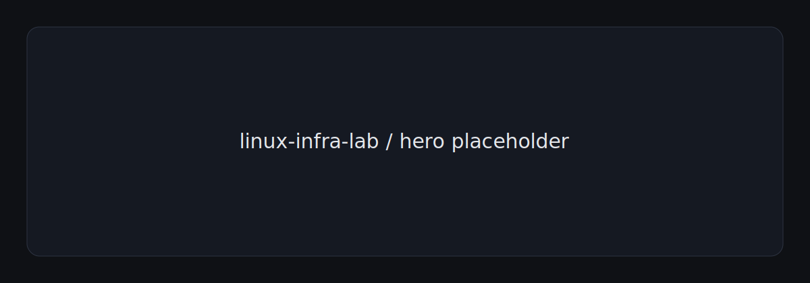
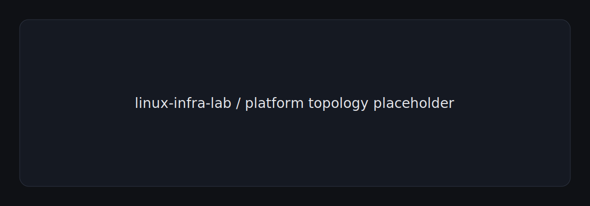
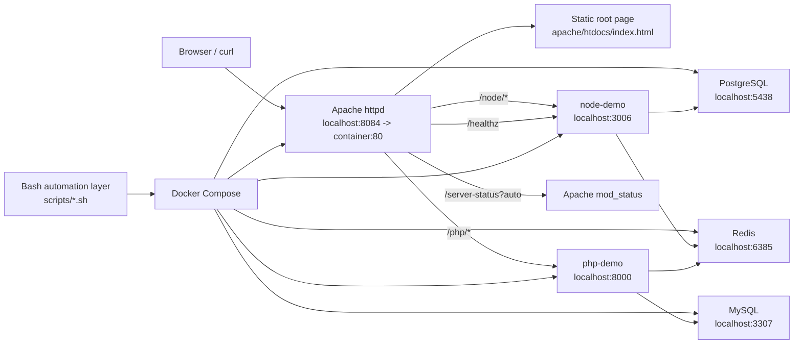
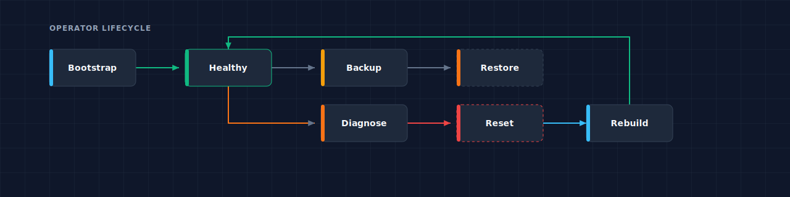
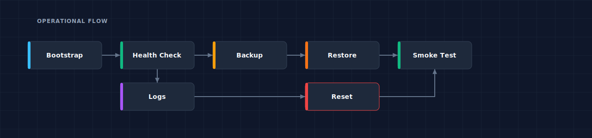
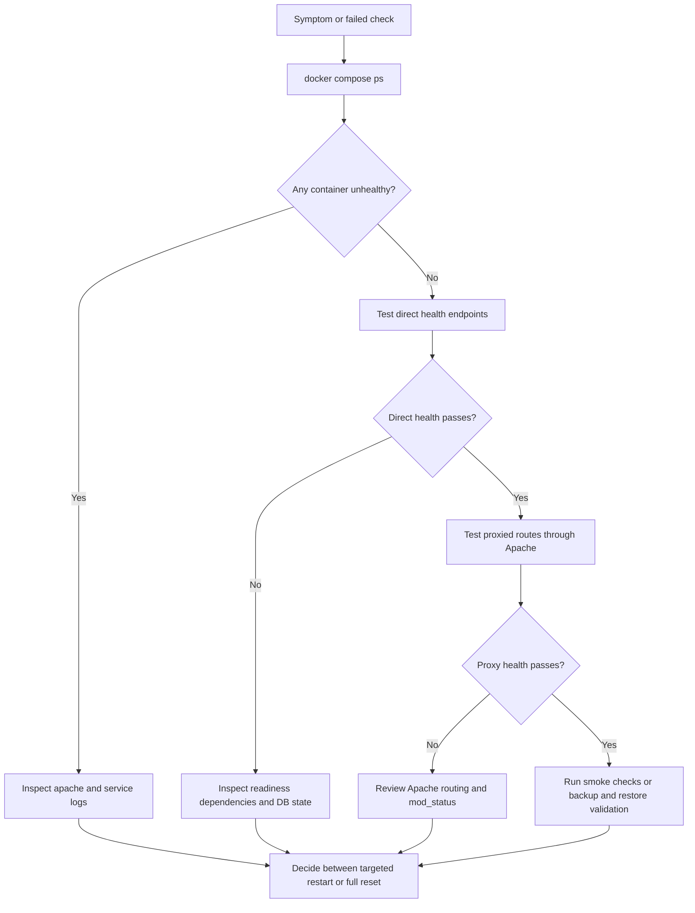

# linux-infra-lab

**Local-first infrastructure lab for Apache reverse proxying, Docker Compose orchestration, Bash automation, and database recovery drills.**

`linux-infra-lab` is an operations portfolio repository. It is intentionally small in application logic and dense in operational signal: ingress routing, service health, backup and restore, log inspection, cron maintenance, and reset or rebuild workflows are treated as first-class parts of the project rather than afterthought scripts.



## Quick Navigation

- [Why This Repository Matters](#why-this-repository-matters)
- [Architecture / Topology Overview](#architecture--topology-overview)
- [Workflow / Runbook Model](#workflow--runbook-model)
- [Capability Matrix](#capability-matrix)
- [Local Workflow](#local-workflow)
- [Operations / Troubleshooting Model](#operations--troubleshooting-model)
- [Validation / Quality](#validation--quality)
- [Repository Structure](#repository-structure)
- [Docs Map](#docs-map)
- [Scope Boundaries](#scope-boundaries)
- [Future Improvements](#future-improvements)

## Why This Repository Matters

This repository is built to show infrastructure and operations thinking in a compact, reviewer-friendly form. The value is not in the demo applications themselves. The value is in how the stack is assembled, verified, backed up, restored, inspected, and reset.

What makes it stronger than a folder of Compose files:

- Apache routing is explicit and observable, with proxied health endpoints and `mod_status` exposed for local diagnostics.
- Service startup order is disciplined through Compose health checks and dependency gating.
- Bash automation is written in strict mode, shares a common library, validates input, and wraps recurring operator tasks.
- PostgreSQL and MySQL are not just present as dependencies; they are exercised through backup, restore, and restore-validation drills.
- Logs, retention cleanup, cron examples, smoke checks, and reset flows turn the repository into a small but complete operating model.

## Architecture / Topology Overview

Apache is the only edge proxy in the current implementation. There is no Nginx layer in this repository. That keeps route ownership, diagnostics, and failure analysis in one place while still demonstrating reverse proxy behavior, upstream routing, and health-aware orchestration.





| Layer | Component | Role in the stack | Operational signal |
| --- | --- | --- | --- |
| Edge | Apache (`httpd:2.4-alpine`) | Terminates local HTTP, proxies `/node/` and `/php/`, exposes `/healthz` and `/server-status?auto`, serves the static root page | `docker compose logs apache`, `logs/apache/*`, `http://localhost:8084/server-status?auto` |
| Application | `node-demo` | Simple Node.js service with `/health` and `/ready`; readiness checks PostgreSQL and Redis TCP reachability | Direct health on `:3006`, proxied health on `/node/health` |
| Application | `php-demo` | Simple PHP service with `/health` and `/ready`; readiness checks MySQL and Redis TCP reachability | Direct health on `:8000`, proxied health on `/php/health` |
| Data | PostgreSQL | Stores seeded `service_events` data used by backup and restore drills | `pg_isready`, `backup-postgres.sh`, `restore-postgres.sh` |
| Data | MySQL | Stores seeded `maintenance_runs` data used by backup and restore drills | `mysqladmin ping`, `backup-mysql.sh`, `restore-mysql.sh` |
| Data | Redis | Lightweight dependency target for readiness probes | `redis-cli ping` |
| Orchestration | Docker Compose | Declares the topology, named volumes, health checks, and startup dependencies on `infra-net` | `docker compose config -q`, `docker compose ps` |
| Automation | Bash scripts | Bootstrap, smoke tests, health summaries, logs, backups, restores, cleanup, and reset workflows | `scripts/`, `Makefile`, cron examples |

## Workflow / Runbook Model

The operating model is built around a predictable loop: bootstrap the stack, verify both direct and proxied health, perform database backups, prove restoreability, inspect logs, and reset the environment when the lab needs to return to a clean state.




| Runbook phase | Primary command | What it does |
| --- | --- | --- |
| Bootstrap | `bash ./scripts/bootstrap.sh` | Creates `.env` if needed, ensures backup and log directories exist, starts the stack, and waits for proxied health endpoints |
| Health check | `bash ./scripts/healthcheck.sh` | Checks container state, direct and proxied HTTP endpoints, Apache status, PostgreSQL, MySQL, and Redis |
| Smoke check | `bash ./scripts/smoke-test.sh` | Verifies response content, route wiring, Apache alias behavior, and data-service readiness |
| Backup | `bash ./scripts/backup-postgres.sh` and `bash ./scripts/backup-mysql.sh` | Produces timestamped SQL dumps and enforces local retention cleanup |
| Restore drill | `bash ./scripts/test-backup-restore.sh` | Inserts sentinel rows, backs up both databases, deletes the sentinel rows, restores from backup, and proves the rows return |
| Logs and cleanup | `bash ./scripts/log-summary.sh` and `bash ./scripts/log-cleanup.sh --days N` | Summarizes Apache and container logs, reports suspicious lines, and removes stale local log files |
| Reset and rebuild | `bash ./scripts/reset-env.sh --force` | Removes containers, volumes, generated logs, and backups unless flags tell it to preserve them |
| Scheduled maintenance | `scripts/cron/maintenance.cron` | Provides example cron entries for periodic health snapshots, nightly backups, and weekly cleanup |

## Capability Matrix

| Area | Implemented behavior | Primary command or file | Validation path |
| --- | --- | --- | --- |
| Reverse proxy routing | Apache proxies `/node/*` and `/php/*`, redirects `/node` and `/php` to trailing-slash routes, exposes `/healthz` and `mod_status` | `apache/vhosts/default.conf` | `bash ./scripts/smoke-test.sh` |
| Docker Compose orchestration | Six-service topology with bridge networking, named volumes, and `service_healthy` dependency gating | `docker-compose.yml` | `docker compose config -q` |
| Bash automation | Strict-mode scripts with shared env loading and reusable helpers | `scripts/lib/common.sh` | `bash ./scripts/lint.sh` |
| PostgreSQL backup and restore | `pg_dump` backup, `psql` restore, seeded table used for restore drill | `scripts/backup-postgres.sh` and `scripts/restore-postgres.sh` | `bash ./scripts/test-backup-restore.sh` |
| MySQL backup and restore | `mysqldump` backup, `mysql` restore, seeded table used for restore drill | `scripts/backup-mysql.sh` and `scripts/restore-mysql.sh` | `bash ./scripts/test-backup-restore.sh` |
| Health checks | Direct, proxied, and data-service health verification | `scripts/healthcheck.sh` | `bash ./scripts/healthcheck.sh` |
| Log inspection | Apache file logs plus `docker compose logs` summaries with a suspicious-line count | `scripts/log-summary.sh` | `bash ./scripts/log-summary.sh --since 30m --tail 80` |
| Cron workflows | Periodic health snapshots, nightly backups, weekly log cleanup | `scripts/cron/maintenance.cron` | Manual install on a Linux host |
| Troubleshooting docs | Failure-oriented runbook for proxy, service, and data-path diagnosis | `docs/troubleshooting.md` | Follow the diagnostic flow |
| Validation and CI | Lint, bootstrap, smoke, health, backup and restore, log summary, and reset in GitHub Actions | `.github/workflows/ci.yml` | Push or pull request workflow |

## Local Workflow

### Quick Start

```bash
cp .env.example .env
bash ./scripts/bootstrap.sh
bash ./scripts/healthcheck.sh
bash ./scripts/smoke-test.sh
```

### Operator Command Map

| Task | Primary command | Optional `make` target |
| --- | --- | --- |
| Bootstrap the lab | `bash ./scripts/bootstrap.sh` | `make bootstrap` |
| Start or rebuild the stack | `docker compose up -d --build` | `make up` |
| Stop the stack | `docker compose down` | `make down` |
| Health summary | `bash ./scripts/healthcheck.sh` | `make health` |
| Smoke checks | `bash ./scripts/smoke-test.sh` | `make smoke` |
| Lint shell and Compose config | `bash ./scripts/lint.sh` | `make lint` |
| Log summary snapshot | `bash ./scripts/log-summary.sh --since 30m --tail 80` | `make logs` |
| Create both DB backups | `bash ./scripts/backup-postgres.sh` and `bash ./scripts/backup-mysql.sh` | `make backup` |
| Validate both restore flows | `bash ./scripts/test-backup-restore.sh` | `make backup-restore` |
| Reset the environment | `bash ./scripts/reset-env.sh --force` | `make reset` |

### Compose and Endpoint Checks

```bash
docker compose config -q
docker compose ps
curl -fsS http://localhost:8084/
curl -fsS http://localhost:8084/node/health
curl -fsS http://localhost:8084/php/health
curl -fsS http://localhost:8084/server-status?auto
```

### Backup and Restore Commands

```bash
bash ./scripts/backup-postgres.sh
bash ./scripts/backup-mysql.sh

bash ./scripts/restore-postgres.sh backups/postgres/<backup>.sql
bash ./scripts/restore-mysql.sh backups/mysql/<backup>.sql
```

### Reset and Rebuild

```bash
bash ./scripts/reset-env.sh --force --preserve-env
bash ./scripts/bootstrap.sh
bash ./scripts/smoke-test.sh
```

## Operations / Troubleshooting Model

Troubleshooting in this repository follows a deliberate order: check Compose state first, compare direct service health against proxied health, inspect Apache and container logs, then use backup or reset workflows only after the failure path is understood.





| Diagnostic area | What to inspect | Primary commands |
| --- | --- | --- |
| Service diagnostics | Container health, direct `/health`, and `/ready` behavior | `docker compose ps`, `curl -fsS http://localhost:3006/ready`, `curl -fsS http://localhost:8000/ready` |
| Proxy diagnostics | Apache route behavior, redirect handling, and `mod_status` output | `curl -i http://localhost:8084/node/health`, `curl -i http://localhost:8084/php/health`, `curl -fsS http://localhost:8084/server-status?auto` |
| Backup validation | Confirm new artifacts exist and use the sentinel-based restore drill when integrity matters | `ls backups/postgres`, `ls backups/mysql`, `bash ./scripts/test-backup-restore.sh` |
| Log usage | Review Apache access and error logs alongside recent container logs | `bash ./scripts/log-summary.sh --since 30m --tail 100` |
| Full recovery | Return the lab to a known-good state when targeted diagnosis is no longer efficient | `bash ./scripts/reset-env.sh --force`, `bash ./scripts/bootstrap.sh` |

## Validation / Quality

| Check | Command or workflow | What it proves |
| --- | --- | --- |
| Shell linting | `bash ./scripts/lint.sh` | Shell scripts pass `shellcheck`, `shfmt`, and Compose config validation |
| Compose validation | `docker compose config -q` | The rendered topology is syntactically valid |
| Smoke checks | `bash ./scripts/smoke-test.sh` | Direct and proxied endpoints, Apache alias routing, `mod_status`, and data-service readiness all behave as expected |
| Backup and restore validation | `bash ./scripts/test-backup-restore.sh` | PostgreSQL and MySQL backups can recreate deleted sentinel rows from seeded tables |
| Reset and rebuild validation | `bash ./scripts/reset-env.sh --force --preserve-env` followed by bootstrap and smoke checks | The lab can return to a clean working baseline |
| Continuous integration | `.github/workflows/ci.yml` | Lint and integration checks run on pull requests and pushes to `main` |

## Repository Structure

```text
.
|-- .github/
|   `-- workflows/
|       `-- ci.yml
|-- apache/
|   |-- htdocs/
|   |   `-- index.html
|   |-- httpd.conf
|   `-- vhosts/
|       `-- default.conf
|-- assets/
|   `-- readme/
|       |-- async-flow.svg
|       |-- hero.svg
|       |-- lifecycle-overview.svg
|       `-- platform-topology.svg
|-- docker/
|   |-- mysql/
|   |   `-- init/
|   |       `-- 01_schema.sql
|   `-- postgres/
|       `-- init/
|           `-- 01_schema.sql
|-- docs/
|   |-- architecture.md
|   |-- deployment-notes.md
|   |-- local-development.md
|   |-- roadmap.md
|   |-- runbooks.md
|   |-- security.md
|   |-- topology.md
|   `-- troubleshooting.md
|-- scripts/
|   |-- cron/
|   |   `-- maintenance.cron
|   |-- lib/
|   |   `-- common.sh
|   |-- backup-mysql.sh
|   |-- backup-postgres.sh
|   |-- bootstrap.sh
|   |-- healthcheck.sh
|   |-- lint.sh
|   |-- log-cleanup.sh
|   |-- log-summary.sh
|   |-- reset-env.sh
|   |-- restore-mysql.sh
|   |-- restore-postgres.sh
|   |-- smoke-test.sh
|   `-- test-backup-restore.sh
|-- services/
|   |-- node-demo/
|   |   |-- Dockerfile
|   |   `-- server.js
|   `-- php-demo/
|       |-- Dockerfile
|       `-- index.php
|-- .env.example
|-- docker-compose.yml
|-- LICENSE
|-- Makefile
`-- README.md
```

Generated at runtime:

- `backups/mysql` and `backups/postgres` for SQL dumps
- `logs/apache` and `logs/cron` for operator-visible logs

## Docs Map

| Document | Focus | Use it when you need to... |
| --- | --- | --- |
| [docs/architecture.md](docs/architecture.md) | System intent and component responsibilities | Understand why the stack is shaped this way |
| [docs/topology.md](docs/topology.md) | Routes, ports, dependencies, and startup ordering | Trace traffic and service relationships |
| [docs/runbooks.md](docs/runbooks.md) | Operator workflows | Bootstrap, back up, restore, clean up, or reset the lab |
| [docs/troubleshooting.md](docs/troubleshooting.md) | Failure diagnosis | Follow a consistent path during incidents |
| [docs/security.md](docs/security.md) | Local-first security posture and hardening priorities | Review controls and boundaries |
| [docs/local-development.md](docs/local-development.md) | Day-to-day usage | Work locally with the stack and scripts |
| [docs/deployment-notes.md](docs/deployment-notes.md) | Small-host deployment notes | Adapt the lab to a Linux VM or homelab host |
| [docs/roadmap.md](docs/roadmap.md) | Realistic next steps | See what is intentionally left for later |

## Scope Boundaries

| Implemented now | Intentionally outside the current implementation |
| --- | --- |
| Local-first Compose topology on a single Docker host | Kubernetes, multi-node orchestration, or cloud-specific deployment automation |
| Apache as the sole edge proxy | Nginx, load balancer tiers, or service mesh layers |
| Local `.env` workflow for operator convenience | Secret managers, vault-backed injection, or external credential rotation |
| Filesystem SQL backups with retention cleanup | Remote encrypted archival, replication, or PITR tooling |
| Apache status and local diagnostics | Internet-facing hardening by default, TLS termination, or IP-restricted status endpoints |

## Future Improvements

- Add an optional TLS-enabled Apache profile and local certificate workflow.
- Add an observability profile for metrics and dashboarding without changing the core lab shape.
- Add encrypted off-host backup export as an extension to the current filesystem backup model.
- Add more failure drills around dependency loss, disk pressure, and partial recovery timing.
