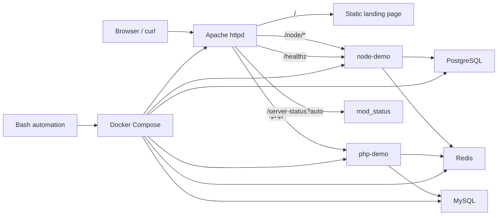

# Architecture

`linux-infra-lab` is designed as a small, local-first platform with a high operational signal-to-size ratio. The application code is intentionally simple. The infrastructure, routing, verification, backup, restore, and troubleshooting workflows are the main subject of the repository.

## Design Intent

- Keep the topology reproducible on a single Linux or Docker host.
- Make ingress routing explicit and easy to debug.
- Treat health checks, backup and restore, and reset workflows as part of the architecture.
- Keep dependency paths visible through direct endpoints, proxied endpoints, and container health checks.
- Prefer simple components over layered complexity that would dilute the operational story.

## System View

Apache is the only edge proxy in the current implementation. Nginx is not part of this stack. That keeps the request path, route ownership, and diagnostics concentrated in one place.

## Component Responsibilities

| Component | Responsibility | Key implementation detail |
| --- | --- | --- |
| `apache` | Local ingress, reverse proxy, static root page, and Apache status visibility | `apache/vhosts/default.conf` proxies `/node/` and `/php/`, redirects trailing-slash routes, and exposes `/healthz` plus `/server-status` |
| `node-demo` | Health-aware upstream service for the Node path | `/health` reports liveness, `/ready` validates PostgreSQL and Redis TCP reachability |
| `php-demo` | Health-aware upstream service for the PHP path | `/health` reports liveness, `/ready` validates MySQL and Redis TCP reachability |
| `postgres` | Relational datastore used in restore drills | Seeded by `docker/postgres/init/01_schema.sql` with the `service_events` table |
| `mysql` | Relational datastore used in restore drills | Seeded by `docker/mysql/init/01_schema.sql` with the `maintenance_runs` table |
| `redis` | Shared lightweight dependency for readiness checks | Exposed only as a dependency target, not as a primary application datastore |
| `docker-compose.yml` | Topology definition, network, ports, health checks, and startup order | Uses `depends_on` with `condition: service_healthy` across services |
| `scripts/*.sh` | Operator automation layer | Strict Bash mode, shared common library, env loading, and reusable validation patterns |

## Request and Dependency Paths

- Client traffic enters through Apache on `localhost:8084` by default.
- Apache proxies `/node/*` to `node-demo:3006` and `/php/*` to `php-demo:8000`.
- Apache exposes `/healthz` as a short alias to the Node health endpoint.
- Apache `mod_status` is enabled for local diagnostics through `/server-status?auto`.
- `node-demo` does not query PostgreSQL or Redis for business logic; it checks TCP reachability in `/ready` to prove dependency awareness.
- `php-demo` uses the same readiness pattern for MySQL and Redis.
- PostgreSQL and MySQL are initialized with simple seeded tables so the restore drill can prove that backups are useful, not merely created.

## Automation as Part of the Architecture

The script layer is not auxiliary. It is part of the system design.

| Script | Architectural role |
| --- | --- |
| `scripts/bootstrap.sh` | Establishes generated directories, starts the stack, and blocks until proxied health endpoints respond |
| `scripts/healthcheck.sh` | Verifies direct service health, proxied health, Apache status, and data-service readiness in one pass |
| `scripts/smoke-test.sh` | Confirms not just reachability but route correctness and expected response content |
| `scripts/backup-*.sh` | Produces timestamped SQL dumps and enforces local retention cleanup |
| `scripts/restore-*.sh` | Restores SQL dumps with argument validation and optional gzip support |
| `scripts/test-backup-restore.sh` | Exercises both backup and restore flows with sentinel data |
| `scripts/log-summary.sh` | Aggregates Apache file logs and recent container logs for triage |
| `scripts/log-cleanup.sh` | Applies retention cleanup to local log files |
| `scripts/reset-env.sh` | Returns the lab to a clean baseline, with flags for preserving backups or `.env` |

## Architecture Decisions

| Decision | Reason |
| --- | --- |
| Apache instead of multiple proxy layers | Keeps reverse proxy behavior, headers, and status inspection in one place |
| Small demo services instead of full applications | Focus stays on infra operations rather than framework complexity |
| Direct and proxied endpoints | Makes it easy to isolate edge failures from app failures |
| Named volumes for MySQL and PostgreSQL | Supports repeatable resets and clear persistence boundaries |
| Local file-backed backups | Keeps backup and restore drills visible and easy to review |
| Strict Bash automation | Reduces operator error and keeps script behavior consistent |

## Related Documents

- [Topology](topology.md)
- [Runbooks](runbooks.md)
- [Troubleshooting](troubleshooting.md)
- [Security](security.md)
