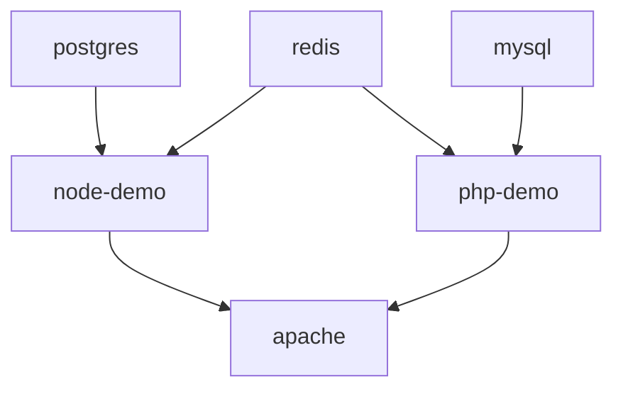

# Topology

This document describes how traffic enters the stack, how services relate to each other, which ports are exposed locally, and how Compose startup order is enforced.

## Edge and Routing Model

Apache is the public entry point in local development. It serves the static root page and proxies application traffic to the two demo services.

| Path | Destination | Purpose |
| --- | --- | --- |
| `/` | `apache/htdocs/index.html` | Simple operator-facing landing page |
| `/node/` | `http://node-demo:3006/` | Node service route prefix |
| `/php/` | `http://php-demo:8000/` | PHP service route prefix |
| `/node/health` | `node-demo /health` | Proxied Node liveness check |
| `/php/health` | `php-demo /health` | Proxied PHP liveness check |
| `/healthz` | `node-demo /health` | Short Apache-level health alias |
| `/server-status?auto` | Apache `mod_status` | Local server-state inspection |

Redirects in `apache/vhosts/default.conf` normalize `/node` to `/node/` and `/php` to `/php/`.

## Port Map

| Service | Host port | Container port | Why it is exposed |
| --- | --- | --- | --- |
| Apache | `8084` | `80` | Primary ingress for the lab |
| Node | `3006` | `3006` | Direct health and readiness inspection |
| PHP | `8000` | `8000` | Direct health and readiness inspection |
| MySQL | `3307` | `3306` | Local operator access and restore tooling |
| PostgreSQL | `5438` | `5432` | Local operator access and restore tooling |
| Redis | `6385` | `6379` | Local operator access and readiness verification |

## Dependency Graph

## Startup and Health Ordering

Compose uses container health checks and dependency gating to avoid racing the edge proxy against unhealthy upstreams.

| Service | Health check | Startup dependency |
| --- | --- | --- |
| `postgres` | `pg_isready -U $POSTGRES_USER -d $POSTGRES_DB` | Independent |
| `mysql` | `mysqladmin ping -h 127.0.0.1 -uroot` | Independent |
| `redis` | `redis-cli ping` | Independent |
| `node-demo` | Internal HTTP request to `/health` | Waits for healthy `postgres` and `redis` |
| `php-demo` | Internal HTTP request to `/health` | Waits for healthy `mysql` and `redis` |
| `apache` | `wget` to `/server-status?auto` | Waits for healthy `node-demo` and `php-demo` |

## Network Model

- All services run on the `infra-net` bridge network.
- Apache is the intended operator entry point, but direct host ports remain exposed so failures can be isolated quickly.
- MySQL and PostgreSQL data are persisted through Docker named volumes.
- Apache configuration and the static landing page are mounted read-only from the repository.

## Operator View of the Topology

When debugging, the topology should be read in this order:

1. `docker compose ps` for container state.
2. Direct health checks on `:3006` and `:8000`.
3. Proxied health checks on `:8084/node/health` and `:8084/php/health`.
4. Apache status on `:8084/server-status?auto`.
5. Database and Redis readiness checks from the script layer.

## Related Documents

- [Architecture](architecture.md)
- [Runbooks](runbooks.md)
- [Troubleshooting](troubleshooting.md)
- [Local Development](local-development.md)
