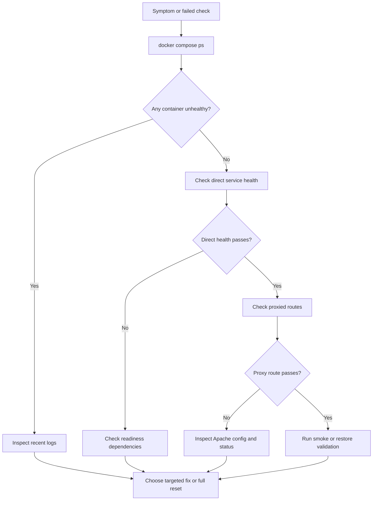

# Troubleshooting

The quickest way to lose time in this lab is to inspect the wrong layer first. Start with container state, move to direct service health, then move to proxied routes through Apache. Use resets only after you understand whether the failure is in routing, service startup, dependency readiness, or persistent state.

## Diagnostic Order



## Apache Is Unhealthy

| Check | Command | Why it matters |
| --- | --- | --- |
| Container logs | `docker compose logs apache --tail 200` | Shows startup errors, proxy failures, and status endpoint issues |
| File logs | `tail -n 200 logs/apache/error.log` | Surfaces Apache syntax and runtime problems from the mounted log directory |
| Apache status | `curl -fsS http://localhost:8084/server-status?auto` | Confirms the health check target is reachable |
| Rendered config | `docker compose config -q` | Confirms Compose rendering is valid before restarting |

Typical causes:

- invalid Apache configuration
- unhealthy upstream services
- missing or unwritable log directory on the host

## Proxied Route Fails but the Backend Is Healthy

Compare direct and proxied checks:

```bash
curl -fsS http://localhost:3006/health
curl -fsS http://localhost:8000/health
curl -i http://localhost:8084/node/health
curl -i http://localhost:8084/php/health
```

Focus areas:

- `apache/vhosts/default.conf`
- service names and ports: `node-demo:3006` and `php-demo:8000`
- redirect behavior for `/node` versus `/node/` and `/php` versus `/php/`
- Apache status output and recent Apache error logs

## Readiness or Dependency Failures

When `/ready` fails, the issue is usually not the service process itself. It is usually one of its dependencies.

| Dependency | Direct check | Context |
| --- | --- | --- |
| PostgreSQL | `docker compose exec -T postgres pg_isready -U app -d infra_lab` | Used by `node-demo /ready` |
| MySQL | `docker compose exec -T mysql mysqladmin ping -h 127.0.0.1 -uroot -proot --silent` | Used by `php-demo /ready` |
| Redis | `docker compose exec -T redis redis-cli ping` | Used by both `/ready` endpoints |

Also inspect:

```bash
docker compose logs postgres --tail 100
docker compose logs mysql --tail 100
docker compose logs redis --tail 100
```

Common causes:

- a data service is still initializing
- `.env` credentials changed while existing volumes still contain older state
- a previous interrupted run left the environment inconsistent

## Backup or Restore Failure

Start with the health summary:

```bash
bash ./scripts/healthcheck.sh
```

Then inspect artifacts and container state:

```bash
ls -l backups/postgres
ls -l backups/mysql
docker compose ps
```

What to verify:

- the target backup file exists and is readable
- the destination database container is healthy
- the credentials in `.env` still match the running state
- disk space is available for new backup artifacts

If credentials or persistent state changed significantly, a full reset is usually faster than patching forward.

## Logs Are Missing or Not Updating

| Check | Command |
| --- | --- |
| Apache log directory | `ls -la logs/apache` |
| Cron log directory | `ls -la logs/cron` |
| Generate fresh proxy traffic | `curl -fsS http://localhost:8084/node/health` |
| Re-run the summary | `bash ./scripts/log-summary.sh` |

Apache writes to the mounted `logs/apache` directory. Cron examples write to `logs/cron`. If those directories do not exist yet, run bootstrap first.

## Full Recovery

Use a full recovery only when targeted diagnosis is no longer efficient.

```bash
bash ./scripts/reset-env.sh --force
bash ./scripts/bootstrap.sh
bash ./scripts/healthcheck.sh
bash ./scripts/smoke-test.sh
bash ./scripts/test-backup-restore.sh
```

## Related Documents

- [Runbooks](runbooks.md)
- [Architecture](architecture.md)
- [Topology](topology.md)
- [Local Development](local-development.md)
